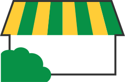
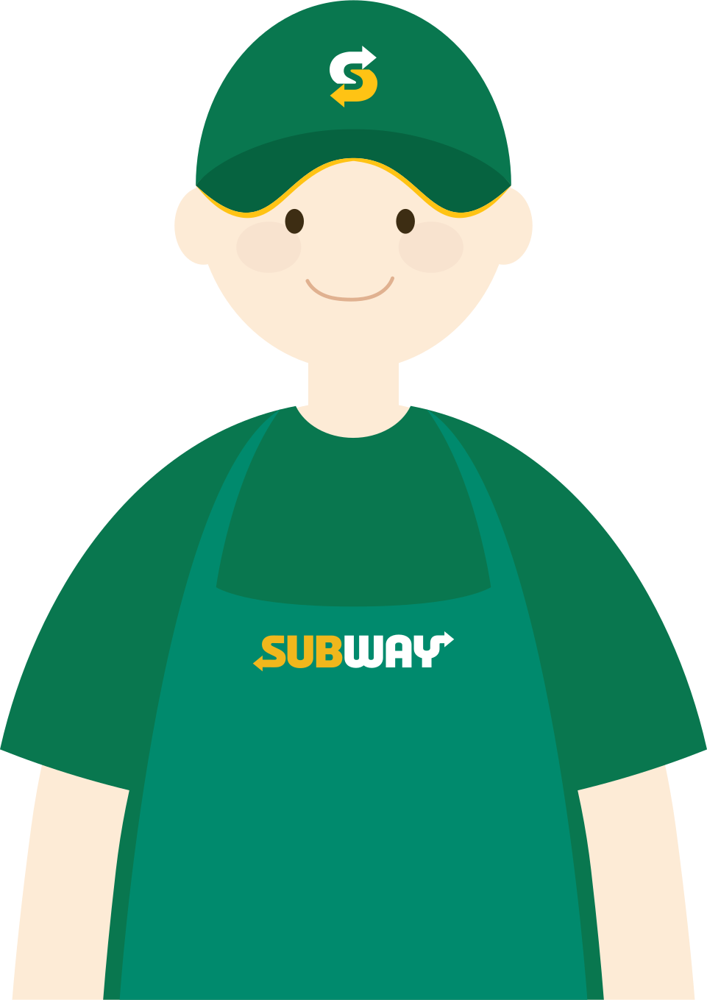

    <h1>Subway-React-Individual</h1> 
    
     
     
    
실제 브랜드인 서브웨이 웹 페이지를 작업하여, 포트폴리오에 상업용 웹사이트의 기능을 재현하였습니다. 다양한 메뉴와 복잡한 기능을 효율적으로 관리하기 위해 리액트를 사용하여 컴포넌트 기반으로 개발하였습니다.

     

    <h2>목차</h2>
    🍀 <a href="#module">사용 모듈</a> 
    🌌 <a href="#boilerplate">보일러플레이트</a> 
    👩‍🔧 <a href="#component">컴포넌트 셋팅 구조</a> 
    📐 <a href="#design">디자인 시안 및 FDD</a> 
    🔎 <a href="#db">db설계</a> 
    ⛔ <a href="#issuse">작업중 이슈</a> 
    🎨 <a href="#Illustrator">자체 제작 일러스트</a> 
    🏠 <a href="#link">작업 관련 링크</a> 
     

    <h2>사용모듈</h2>
    <ul>
        <li>axios: ^1.7.3</li>
        <li>bootstrap: ^5.3.3</li>
        <li>bootstrap-icons: ^1.11.3</li>
        <li>react-hook-form: ^7.52.2</li>
        <li>react-router-dom: ^6.26.0</li>
        <li>reset-css: ^5.0.2</li>
        <li>sass: ^1.77.8</li>
        <li>styled-components: ^6.1.12</li>
        <li>swiper: ^11.1.9</li>
    </ul>
     

    <h2>보일러플레이트</h2>
    <ul> 
        <li>
            <b>css</b>
            <ul>
                <li>./fonts/fonts.css</li>
            </ul>
        </li>
        <li>
            <b>scss</b>
            <ul>
                <li>./scss/common.scss</li>
                <li>./scss/subway.scss</li>
            </ul>
        </li>
        <li>
            <b>js</b>
            <ul>
                <li>./component/style.js</li>
            </ul>
        </li>
        <li>
            <b>svg</b>
            <ul>
                <li>./svg/sandwichartist.svg</li>
                <li>./svg/shop.svg</li>
                <li>./svg/Subway_logo_hover.svg</li>
                <li>./svg/Subway_logo.svg</li>
            </ul>
        </li>
        <li>
            <b>icon</b>
            <ul>
                <li>/public/favicon.ico</li>
                <li>/public/app/subwayapp-m.png</li>
            </ul>
        </li>
    </ul>    
     

    <h2>컴포넌트 셋팅 구조</h2>
    <ul>
        <li>
            <b>Hd: 헤더 및 메뉴</b> 
            사이트 상단의 헤더와 메뉴를 담당합니다. 사용자 네비게이션을 편리하게 돕습니다.
        </li> 
        <li>
            <b>Mainbanner: 메인 슬라이드</b> 
           홈페이지의 메인 슬라이드로, 시각적으로 눈에 띄는 배너를 제공합니다.
        </li> 
        <li>
            <b>Sandwich: 샌드위치</b> 
            서브웨이의 다양한 샌드위치 메뉴를 소개하는 섹션입니다.
        </li> 
        <li>
            <b>Salad: 샐러드</b> 
            여러 종류의 샐러드를 보여주는 컴포넌트입니다.
        </li> 
        <li>
            <b>Smilesub: 서브메뉴</b> 
            서브메뉴를 제공하여 추가적인 메뉴 항목을 쉽게 찾을 수 있습니다.
        </li> 
        <li>
            <b>Withsub: PPL</b> 
            서브웨이 제품 추천 및 프로모션 정보를 담고 있는 컴포넌트입니다.
        </li> 
        <li>
            <b>Notice: 공지사항</b> 
            공지사항을 업데이트하고 사용자에게 중요한 정보를 전달합니다.
        </li> 
        <li>
            <b>Mobileapp: 모바일 앱</b> 
            모바일 앱 다운로드와 관련된 정보를 제공합니다.
        </li> 
        <li>
            <b>Supportmenu: 서포트 메뉴</b> 
            고객 지원 링크와 도움말을 모아놓은 메뉴입니다.
        </li> 
        <li>
            <b>Founding: 창업문의 폼</b> 
            창업 문의를 위한 폼을 포함하여, 관심 있는 사용자에게 직접 문의할 수 있게 합니다.
        </li> 
        <li>
            <b>Ft: 하단 푸터</b> 
            하단 푸터로, 저작권 정보와 추가 링크를 포함합니다.
        </li> 
        <li>
            <b>Quik: 퀵 메뉴</b> 
            탑메뉴와 가까운 매장 찾기 기능을 제공하며, 사용자에게 편리한 접근을 돕습니다.
        </li>
        <li>🎀FDD로 만들기🎀</li>
    </ul>
     

    <h2>디자인 시안</h2>
    
🎀모바일시안,pc시안🎀

     

    <h2>db설계</h2>
    
🎀1.json링크(서버리스)/2.수파베이스테이블캡쳐(매장찾기부분)🎀

     

    <h2>작업중 이슈</h2>
     

    <h2>자체 제작 일러스트</h2>
    <table>
        <tr>
            <th></th>
            <th></th>
        </tr>
        <tr>
            <td>매장 찾기 버튼과 창업 문의 폼 디자인에 활용 되었으며 시각적으로 서브웨이 매장을 직관적으로 표현하여 사용자 경험을 개선하였습니다</td>
            <td>메인 슬라이드 '썹-픽' 배너에서 사용되었으며 서브웨이 직원의 추천을 강조하여 사용자에게 신뢰성과 친근함을 전달하였습니다</td>
        </tr>        
    </table>
     

    <h2>작업 관련 링크</h2>
    <ul>
        <a href="https://www.figma.com/design/XY866tUpmpETFe5KsnckFi/%EC%84%9C%EB%B8%8C%EC%9B%A8%EC%9D%B4?m=auto&t=xFOBIDSViyqol1ag-6">🐖 피그마 바로가기</a> 
        <a href="https://github.com/hyunjiq">😺 깃허브 바로가기</a>
    </ul>

