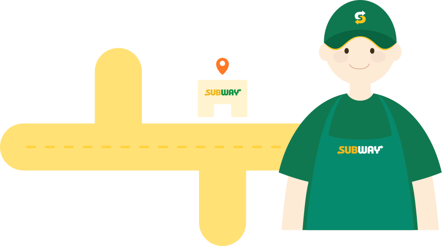

    <h1>Subway-React-Individual</h1> 
    
     
     
    
실제 브랜드인 서브웨이 웹 페이지를 작업하여, 포트폴리오에 상업용 웹사이트의 기능을 재현하였습니다. 다양한 메뉴와 복잡한 기능을 효율적으로 관리하기 위해 리액트를 사용하여 컴포넌트 기반으로 개발하였습니다.

     

    <h2>목차</h2>
    🍀 <a href="#module">사용 모듈</a> 
    🌌 <a href="#boilerplate">보일러플레이트</a> 
    👩‍🔧 <a href="#component">컴포넌트 셋팅 구조</a> 
    📐 <a href="#design">디자인 시안 및 FDD</a> 
    🔎 <a href="#db">db설계</a> 
    ⛔ <a href="#issuse">작업중 이슈</a> 
    🎨 <a href="#Illustrator">자체 제작 일러스트</a> 
    🏠 <a href="#link">작업 관련 링크</a> 
     

    <h2>사용모듈</h2>
    <ul>
        <li>@supabase/supabase-js: ^2.45.3</li>
        <li>axios: ^1.7.3</li>
        <li>bootstrap: ^5.3.3</li>
        <li>bootstrap-icons: ^1.11.3</li>
        <li>react-hook-form: ^7.52.2</li>
        <li>react-router-dom: ^6.26.0</li>
        <li>reset-css: ^5.0.2</li>
        <li>sass: ^1.77.8</li>
        <li>styled-components: ^6.1.12</li>
        <li>swiper: ^11.1.9</li>
    </ul>
     

    <h2>보일러플레이트</h2>
    <ul> 
        <li>
            <b>css</b>
            <ul>
                <li>./fonts/fonts.css</li>
            </ul>
        </li>
        <li>
            <b>scss</b>
            <ul>
                <li>./scss/common.scss</li>
                <li>./scss/subway.scss</li>
            </ul>
        </li>
        <li>
            <b>js</b>
            <ul>
                <li>./component/style.js</li>
            </ul>
        </li>
        <li>
            <b>svg</b>
            <ul>
                <li>./svg/sandwichartist.svg</li>
                <li>./svg/shop.svg</li>
                <li>./svg/Subway_logo_hover.svg</li>
                <li>./svg/Subway_logo.svg</li>
            </ul>
        </li>
        <li>
            <b>icon</b>
            <ul>
                <li>/public/favicon.ico</li>
                <li>/public/app/subwayapp-m.png</li>
            </ul>
        </li>
    </ul>    
     

    <h2>컴포넌트 셋팅 구조</h2>
    
     

    <h2>디자인 시안</h2>
    
pc시안

    
    
모바일시안

    
     

    <h2>db설계</h2>    
    <a href="https://github.com/hyunjiq/Subway-React-Individual/blob/main/src/data/db.json">json 보러가기</a>  
    
수파베이스테이블

    
     
     

    <h2>작업중 이슈</h2>
     

    <h2>자체 제작 일러스트</h2>
    <table>
        <tr>
            <th></th>
            <th></th>
        </tr>
        <tr>
            <td>매장 찾기 버튼과 창업 문의 폼 디자인에 활용 되었으며 시각적으로 서브웨이 매장을 직관적으로 표현하여 사용자 경험을 개선하였습니다.</td>
            <td>메인 슬라이드 '썹-픽' 배너에서 사용되었으며 서브웨이 직원의 추천을 강조하여 사용자에게 신뢰성과 친근함을 전달하였습니다.</td>
        </tr>  
        <tr>
            <th></th>
            <th></th>
        </tr>
        <tr>
            <td>토마토와 버섯을 캐릭터와 결합하여 브웨이의 야채를 연상시키도록 디자인되었습니다. Findrestaurant.js의 지도 팝업에 붙여넣어져, 사용자가 식당 정보를 더 친근하고 시각적으로 인식할 수 있도록 하였습니다.</td>
            <td>지도와 매장 아이콘으로 단순화하고 서브웨이 직원의 이미지를 넣어, 지도에서 서브웨이 위치를 명확하게 인식할 수 있도록 디자인되었습니다. 지도 기반의 검색 기능을 효과적으로 강조하였습니다.</td>
        </tr>              
    </table>
     

    <h2>작업 관련 링크</h2>
    <ul>
        <a href="https://www.figma.com/design/XY866tUpmpETFe5KsnckFi/%EC%84%9C%EB%B8%8C%EC%9B%A8%EC%9D%B4?m=auto&t=xFOBIDSViyqol1ag-6">🐖 피그마 바로가기</a> 
        <a href="https://github.com/hyunjiq">😺 깃허브 바로가기</a>
    </ul>

