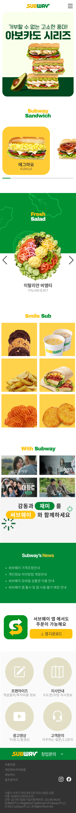

    <h1>Subway-React-Individual</h1> 
    
     
     
    
실제 브랜드인 서브웨이 웹앱 페이지를 작업하여, 포트폴리오에 상업용 웹사이트의 기능을 재현하였습니다. React 플랫폼을 선택한 이유는, 프랜차이즈 사업에서 창업주 모집과 특별 프로모션 같은 한정 메뉴를 통해 소비자에게 새로운 경험을 제공하는 광고에 대비해 빠른 랜딩이 필수적이기 때문입니다.
 
    
프랜차이즈 사업의 목표는 새로운 창업자의 접근성을 높이기 
위한 것이기 때문에 공공 데이터의 오픈 데이터(https://www.data.go.kr/)를 활용하여 창업문의 기능을 구현하였습니다.
또한 사용자들에게 신뢰성 있는 매장 정보를 제공하기 위해 카카오 지도 API를 활용하였습니다.

     

    <h2>목차</h2>
    🍀 <a href="#module">사용 모듈</a> 
    🌌 <a href="#boilerplate">보일러플레이트</a> 
    👩‍🔧 <a href="#component">컴포넌트 셋팅 구조</a> 
    📐 <a href="#design">디자인 시안</a> 
    🔎 <a href="#db">db설계</a> 
    ⛔ <a href="#issuse">작업중 이슈</a> 
    🎨 <a href="#Illustrator">자체 제작 일러스트</a> 
    🏠 <a href="#link">작업 관련 링크</a> 
     

    <h2>🍀 사용모듈</h2>
    <ul>
        <li>@supabase/supabase-js: ^2.45.3</li>
        <li>axios: ^1.7.3</li>
        <li>bootstrap: ^5.3.3</li>
        <li>bootstrap-icons: ^1.11.3</li>
        <li>react-hook-form: ^7.52.2</li>
        <li>react-router-dom: ^6.26.0</li>
        <li>reset-css: ^5.0.2</li>
        <li>sass: ^1.77.8</li>
        <li>styled-components: ^6.1.12</li>
        <li>swiper: ^11.1.9</li>
    </ul>
     

    <h2>🌌 보일러플레이트</h2>
    <ul> 
        <li>
            <b>css</b>
            <ul>
                <li>./fonts/fonts.css</li>
            </ul>
        </li>
        <li>
            <b>scss</b>
            <ul>
                <li>./scss/common.scss</li>
                <li>./scss/subway.scss</li>
            </ul>
        </li>
        <li>
            <b>js</b>
            <ul>
                <li>./component/style.js</li>
            </ul>
        </li>
        <li>
            <b>svg</b>
            <ul>
                <li>./svg/sandwichartist.svg</li>
                <li>./svg/shop.svg</li>
                <li>./svg/Subway_logo_hover.svg</li>
                <li>./svg/Subway_logo.svg</li>
            </ul>
        </li>
        <li>
            <b>icon</b>
            <ul>
                <li>/public/favicon.ico</li>
                <li>/public/app/subwayapp-m.png</li>
            </ul>
        </li>
    </ul>    
     

    <h2>👩‍🔧 컴포넌트 셋팅 구조</h2>
<<<<<<< HEAD
    
    
     

    <h2>📐 디자인 시안</h2>    
    <table  align="center">
        <tr>
            <th>- pc시안</th>
            <th>- 모바일시안</th>
        </tr>
        <tr>
            <td align="center"></td>
            <td align="center"></td>
        </tr> 
    </table>
     

    <h2>🔎 db설계</h2>
    <h4>- JSON 데이터 사용 컴포넌트</h4>
    <ul>
        <li>Hd.js - 메뉴가 변경될 수 있으므로 유동적인 처리가 필요합니다.</li>
        <li>Findrestaurant.js - 매장 위치가 추가되거나 삭제될 수 있습니다.</li>
        <li>Salad.js - 추천 샐러드가 변경될 수 있습니다.</li>
        <li>Sandwich.js - 추천 샌드위치가 변경될 수 있습니다.</li>
        <li>Smilesub.js - 한정판 서브메뉴가 있을 수 있어 변경됩니다.</li>
        <li>Withsub.js - 광고 내용이 추가될 수 있습니다.</li>
        <li>Notice.js - 공지사항이 추가될 수 있습니다.</li>
        <li>Mainbanner.js - 배너 내용이 자주 변경되기 때문에 유동적입니다.</li>
    </ul>
    
json 데이터를 보시려면 <a href="#link">여기</a>를 눌러주세요

    <h4>- 수파베이스테이블</h4>
    

        
    

     
     

    <h2>⛔ 작업중 이슈</h2>
    <h3>모바일 메뉴 자동 닫힘</h3>
    <table>
        <tr>
            <th style="width:50%;">문제</th>
            <th style="width:50%;">해결</th>
        </tr>
        <tr>
            <td>모바일 메뉴에서 '매장찾기' 버튼을 클릭하면 라우터는 정상적으로 변경되었으나, 모바일 메뉴가 자동으로 닫히지 않고 그대로 남아 있는 문제</td>
            <td>useState를 사용하여 모바일 메뉴의 토글 상태를 관리하여 '매장찾기' 버튼을 클릭했을 때, setMenutoggle(false)를 호출하여 메뉴를 닫도록 구현</td>
        </tr> 
    </table>
    <h3>공공데이터 연결</h3>
    <table>
        <tr>
            <th style="width:50%;">문제</th>
            <th style="width:50%;">해결</th>
        </tr>
        <tr>
            <td>데이터 양과 요청 처리: 공공 데이터 API에서 제공하는 데이터의 양이 매우 방대하여(49,874개) 한 번에 요청하면 오류가 발생</td>
            <td>페이지 나누기: 데이터 요청을 여러 페이지로 나누어 반복적으로 수행하여 전체 데이터를 수집</td>
        </tr>  
        <tr>
            <td>중복 및 필터링 문제: 데이터에 중복된 항목이 포함되어 있고, 특정 도시 이름이 '제주도'와 '제주특별자치시' 처럼 여러 형태로 존재</td>
            <td>특정 시/도 목록을 배열로 만들고 배열에 포함된 시/도만 필터링하여 처리</td>
        </tr> 
    </table>
    <h3>Supabase 연결</h3>
    <table>
        <tr>
            <th style="width:50%;">문제</th>
            <th style="width:50%;">해결</th>
        </tr>
        <tr>
            <td>폼 제출 시 데이터 검증: 폼 제출 시 모든 필드를 확인하고, 필수 항목이 비어있을 경우 데이터가 제출되지 않아야 함</td>
            <td>폼 검증 로직 추가: handleSubmit 함수에서 모든 필드가 입력되었는지 확인하고, 데이터가 비어 있으면 제출되지 않도록 처리</td>
        </tr>  
    </table>
     

    <h2>🎨 자체 제작 일러스트</h2>
    <table>
        <tr>
            <th></th>
            <th></th>
        </tr>
        <tr>
            <td>매장 찾기 버튼과 창업 문의 폼 디자인에 활용 되었으며 시각적으로 서브웨이 매장을 직관적으로 표현하여 사용자 경험을 개선하였습니다.</td>
            <td>메인 슬라이드 '썹-픽' 배너에서 사용되었으며 서브웨이 직원의 추천을 강조하여 사용자에게 신뢰성과 친근함을 전달하였습니다.</td>
        </tr>
        <tr>
            <th></th>
            <th></th>
        </tr>
        <tr>
            <td>토마토와 버섯을 캐릭터와 결합하여 브웨이의 야채를 연상시키도록 디자인되었습니다. Findrestaurant.js의 지도 팝업에 붙여넣어져, 사용자가 식당 정보를 더 친근하고 시각적으로 인식할 수 있도록 하였습니다.</td>
            <td>지도와 매장 아이콘으로 단순화하고 서브웨이 직원의 이미지를 넣어, 지도에서 서브웨이 위치를 명확하게 인식할 수 있도록 디자인되었습니다. 지도 기반의 검색 기능을 효과적으로 강조하였습니다.</td>
        </tr> 
    </table>
     

    <h2>🏠 작업 관련 링크</h2>       
        <a href="https://www.figma.com/design/XY866tUpmpETFe5KsnckFi/%EC%84%9C%EB%B8%8C%EC%9B%A8%EC%9D%B4?m=auto&t=xFOBIDSViyqol1ag-6">🐖 피그마 바로가기</a> 
        <a href="https://www.figma.com/board/WCqTi6Cf80Qb3Gp3AD2z1v/%EC%84%9C%EB%B8%8C%EC%9B%A8%EC%9D%B4-FDD?node-id=0-1&t=3NxqlteXNbXHlfFg-1">🍯 DFD & Component Diagram 바로가기</a> 
        <a href="https://github.com/hyunjiq">😺 깃허브 바로가기</a> 
        <a href="https://github.com/hyunjiq/Subway-React-Individual/blob/main/src/data/db.json">📚 json 바로가기</a>  

